<style>
pre {
  max-height: 300px; /* Limits the height */
  overflow-y: auto;  /* Adds vertical scroll if needed */
  overflow-x: auto;  /* Adds horizontal scroll if needed */
}
</style>

Para a construção do modelo foi utilizado inicialmente uma `CNN`, porém como o conjunto de imagens de treino era muito pequeno, cerca de 200 imagens por classe o modelo não conseguia performar muito bem, foi então que incrementei o modelo baseado nos pesos do `imagenet` utilizando modelo `MobileNetV2`.

## Dataset treino
Para a captura dos dados de treino foi utilizado a captura da própria webcam que capurou as imagens com um pequeno delay entre as capturas e recortou os rostos utilizando o `opencv` utilizando o código abaixo (`capture_photos.py`):

```python
import cv2
import os
import time

nome = input("Digite o nome da pessoa: ")
pasta = f"dataset/train/{nome}"

os.makedirs(pasta, exist_ok=True)

max_fotos = 200
face_margin = 0.05

# 🔢 obter índices existentes
arquivos = [f for f in os.listdir(pasta) if f.endswith(".jpg")]

numeros_existentes = sorted([
    int(f.split(".")[0]) for f in arquivos if f.split(".")[0].isdigit()
])

# 🔍 encontrar índices faltantes
faltantes = [i for i in range(max_fotos) if i not in numeros_existentes]

# 🔢 próximo índice sequencial (se não houver faltantes)
proximo = max(numeros_existentes)+1 if numeros_existentes else 0

print(f"Imagens existentes: {len(numeros_existentes)}")
print(f"Faltando: {len(faltantes)}")

face_cascade = cv2.CascadeClassifier(
    cv2.data.haarcascades + 'haarcascade_frontalface_default.xml'
)

cap = cv2.VideoCapture(0)

ultimo_save = 0
intervalo = 0.3

while True:
    ret, frame = cap.read()
    if not ret:
        break

    gray = cv2.cvtColor(frame, cv2.COLOR_BGR2GRAY)

    faces = face_cascade.detectMultiScale(
        gray,
        scaleFactor=1.2,
        minNeighbors=5,
        minSize=(30, 30)
    )

    for (x, y, w, h) in faces:

        tempo_atual = time.time()
        if tempo_atual - ultimo_save < intervalo:
            continue

        center_x = x + (w / 2)
        center_y = y + (h / 2)
        crop_size = int(max(w, h) * (1 + (2 * face_margin)))
        x1 = max(0, int(center_x - (crop_size / 2)))
        y1 = max(0, int(center_y - (crop_size / 2)))
        x2 = min(frame.shape[1], x1 + crop_size)
        y2 = min(frame.shape[0], y1 + crop_size)
        x1 = max(0, x2 - crop_size)
        y1 = max(0, y2 - crop_size)

        rosto = frame[y1:y2, x1:x2]

        if rosto.size == 0:
            continue

        rosto = cv2.resize(rosto, (128,128))

        # 🎯 escolher índice correto
        if faltantes:
            indice = faltantes.pop(0)  # preenche buracos primeiro
        else:
            indice = proximo
            proximo += 1

        caminho = f"{pasta}/{indice}.jpg"
        cv2.imwrite(caminho, rosto)

        ultimo_save = tempo_atual

        total_atual = len(os.listdir(pasta))
        print(f"Salvo: {indice}.jpg | Total: {total_atual}/{max_fotos}")

        cv2.rectangle(frame, (x,y), (x+w,y+h), (255,0,0), 2)

        if total_atual >= max_fotos:
            break

    cv2.imshow("Coletando Faces", frame)

    if len(os.listdir(pasta)) >= max_fotos or cv2.waitKey(1) == 27:
        break

cap.release()
cv2.destroyAllWindows()

print("Dataset completo!")

```

Como a captura é feita pela webcam no mesmo comodo e no mesmo lugar com a mesma iluminação não adiantaria capturar mais imagens para o dataset, só iria saturar o modelo com o que ele já teria aprendido.
As capturas foram colocadas na pasta `dataset/train/nome_da_pessoa`. Foram feitas captura de 3 classes `alan`, `betina`, `maria`.

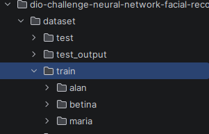

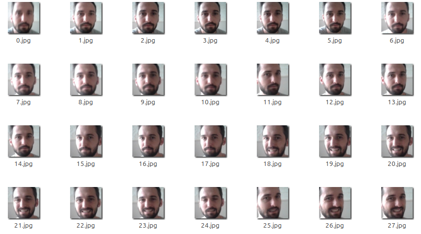

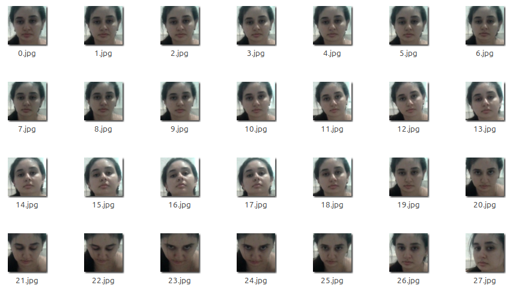

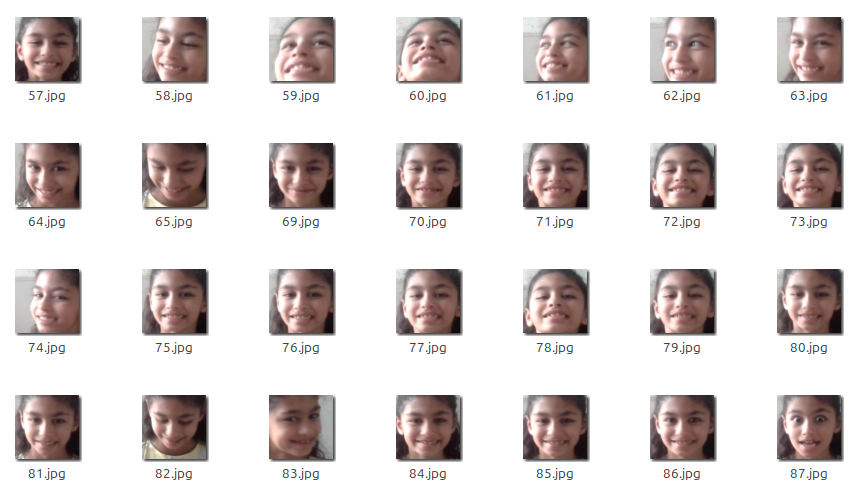

## Dataset validação

Para os dados de validação foram obtidas fotos reais do dia-a-dia da galeria de fotos, estas fotos foram colocadas na pasta `real_photos`, a partir dessas fotos foi aplicado o algoritmo para cortar as faces utilizando `opencv` (`crop_faces.py`) as faces cortadas foram colocadas na pasta `real_val` e depois copiadas para `dataset/val/nome_da_pessoa`.

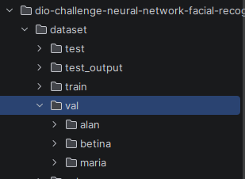

Fotos reais:

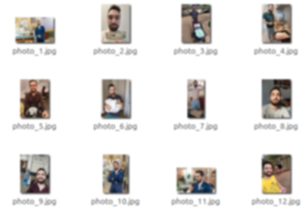

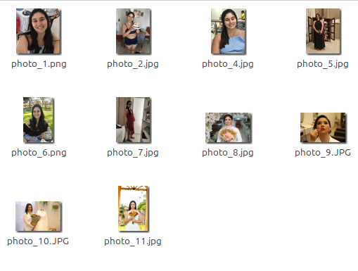

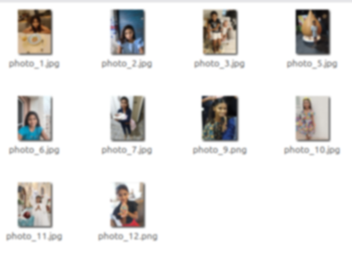

Fotos recortadas:

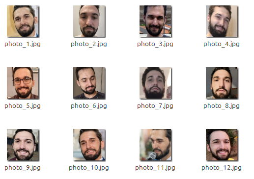

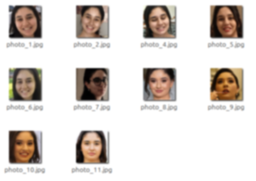

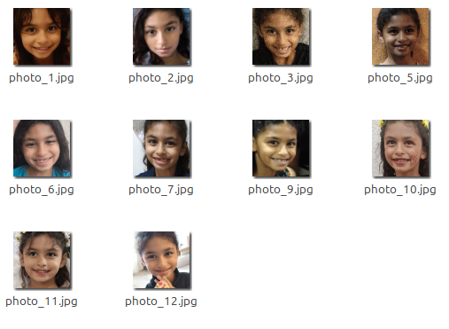

## Dataset de teste

Para os dados de teste foram obtidas fotos reais com as 3 pessoas juntas ou mais pessoas desconhecidas

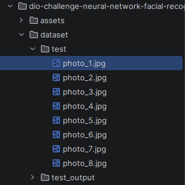

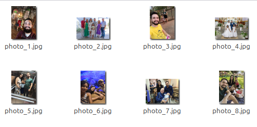

## Configuração do Modelo

O modelo utilizado foi o `MobileNetV2` com os pesos do `imagenet`, a partir do modelo foi feito o fine tuning utilizando
as imagens do dataset local com as fotos capturadas:

```python
base_model = MobileNetV2(
    input_shape=(IMG_SIZE, IMG_SIZE, 3),
    include_top=False,
    weights="imagenet",
)
base_model.trainable = False
```

Camadas da rede neural:

```python
inputs = layers.Input(shape=(IMG_SIZE, IMG_SIZE, 3))
x = data_augmentation(inputs)
x = preprocess_input(x)
x = base_model(x, training=False)
x = layers.GlobalAveragePooling2D()(x)
x = layers.Dropout(FIRST_DROPOUT)(x)
x = layers.Dense(96, activation="relu", kernel_regularizer=reg)(x)
x = layers.Dropout(SECOND_DROPOUT)(x)
outputs = layers.Dense(len(class_names), activation="softmax", dtype="float32")(x)
model = models.Model(inputs, outputs)
```

A primeira camada foi a camada de entrada do modelo com imagens 
128x128, a segunda camada foi feito um data augmentation das imagens com flip horizontal, rotação, translação, zoom, 
brilho e contraste para ajudar a variar um pouco as poucas capturas que temos, foi adicionado tbm um dropout para 
desativar alguns neuronios e evitar overfitting, e uma regularização na camada dense.

Como o treino foi feito local foi utilizado uma otimização para a placa de video:

```python
mixed_precision.set_global_policy('mixed_float16')
```

Os outros parametros da rede como batch_size, epochs, learning_rate, dropout, patience foram ajustados e modificado no
decorrer dos varios treinamentos realizados, comparando suas metricas, resultados obtidos nas imagens de validação e testes.

Foram ajustados também os pesos das classes pois em determinado momento o modelo reconhecia muito bem `alan`, porém
confundia `maria` com `betina`

```python
CLASS_WEIGHT_OVERRIDES = {
    "maria": 1.4,
    "betina": 1.2,
    "alan":0.9,
}0,000000000000000000000000000
```

## Treino do modelo

Saida do treino:

```shell
(tf) aecher@aecher-RYZEN:~/tf/projects/dio-challenge-neural-network-facial-recognize-challenge$ python train_model.py 
2026-04-30 11:43:50.521994: I tensorflow/core/platform/cpu_feature_guard.cc:210] This TensorFlow binary is optimized to use available CPU instructions in performance-critical operations.
To enable the following instructions: SSE3 SSE4.1 SSE4.2 AVX AVX2 FMA, in other operations, rebuild TensorFlow with the appropriate compiler flags.
/home/aecher/tf/lib/python3.12/site-packages/keras/src/export/tf2onnx_lib.py:8: FutureWarning: In the future `np.object` will be defined as the corresponding NumPy scalar.
  if not hasattr(np, "object"):
GPU detectada: [PhysicalDevice(name='/physical_device:GPU:0', device_type='GPU')]
Classes: ['alan', 'betina', 'maria']
alan: 200 treino, 12 validacao
betina: 201 treino, 10 validacao
maria: 193 treino, 10 validacao
WARNING: All log messages before absl::InitializeLog() is called are written to STDERR
I0000 00:00:1777560232.222148  140149 gpu_device.cc:2020] Created device /job:localhost/replica:0/task:0/device:GPU:0 with 5196 MB memory:  -> device: 0, name: NVIDIA GeForce RTX 5060, pci bus id: 0000:07:00.0, compute capability: 12.0
Training config: {'head_lr': 2e-05, 'fine_tune_lr': 2e-05, 'fine_tune_layers': 40, 'dropout': [0.15, 0.15], 'early_stop_patience': 20, 'reduce_lr_patience': 20}
Class weights: {'alan': 0.9, 'betina': 1.2, 'maria': 1.4}

Predicoes por classe: {'alan': 10, 'betina': 10, 'maria': 12}

=== Classification Report ===

              precision    recall  f1-score   support

        alan       1.00      0.83      0.91        12
      betina       0.90      0.90      0.90        10
       maria       0.83      1.00      0.91        10

    accuracy                           0.91        32
   macro avg       0.91      0.91      0.91        32
weighted avg       0.92      0.91      0.91        32
```

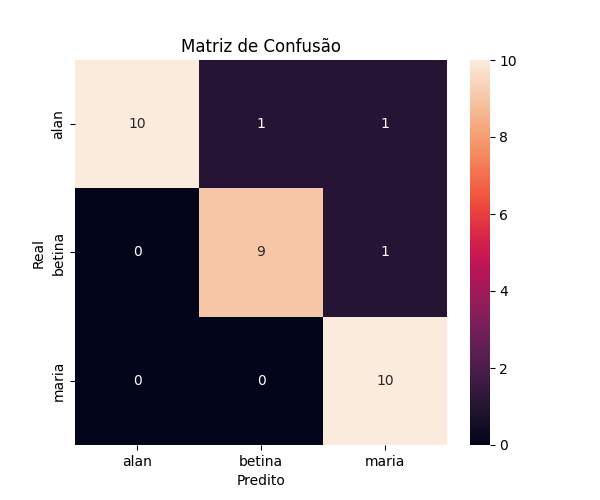

O codigo do treino completo esta no `train_model.py`:

```python
import matplotlib
matplotlib.use('Agg')
import matplotlib.pyplot as plt
import numpy as np
from pathlib import Path
from sklearn.metrics import confusion_matrix, classification_report
import tensorflow as tf
from tensorflow.keras import layers, models
from tensorflow.keras.callbacks import EarlyStopping
from tensorflow.keras.callbacks import ModelCheckpoint
from tensorflow.keras.callbacks import ReduceLROnPlateau
from tensorflow.keras import mixed_precision
from tensorflow.keras import regularizers
from tensorflow.keras.applications import MobileNetV2
from tensorflow.keras.applications.mobilenet_v2 import preprocess_input
import seaborn as sns

mixed_precision.set_global_policy('mixed_float16')

# 🔥 força uso de GPU (se disponível)
gpus = tf.config.list_physical_devices('GPU')
if gpus:
    print("GPU detectada:", gpus)
else:
    print("Rodando em CPU")

IMG_SIZE = 128
BATCH_SIZE = 16
SEED=123
HEAD_EPOCHS = 70
FINE_TUNE_EPOCHS = 70
FINE_TUNE_LAYERS = 40
HEAD_LEARNING_RATE = 2e-5
FINE_TUNE_LEARNING_RATE = 2e-5
FIRST_DROPOUT = 0.15
SECOND_DROPOUT = 0.15
EARLY_STOP_PATIENCE = 20
REDUCE_LR_PATIENCE = 20
CHECKPOINT_MIN_VAL_ACCURACY = 0.70
CLASS_WEIGHT_OVERRIDES = {
    "maria": 1.4,
    "betina": 1.2,
    "alan":0.9,
}

DATASET_DIR = Path("dataset")
TRAIN_DIR = DATASET_DIR / "train"
VAL_DIR = DATASET_DIR / "val"
IMAGE_EXTENSIONS = {".jpg", ".jpeg", ".png", ".bmp", ".gif", ".webp"}

if not TRAIN_DIR.exists() or not VAL_DIR.exists():
    raise FileNotFoundError(
        "Estrutura esperada: dataset/train/<classe> e dataset/val/<classe>"
    )

class_names = sorted(path.name for path in TRAIN_DIR.iterdir() if path.is_dir())
val_class_names = sorted(path.name for path in VAL_DIR.iterdir() if path.is_dir())
if class_names != val_class_names:
    raise ValueError(
        f"Classes diferentes entre treino e validacao: "
        f"train={class_names}, val={val_class_names}"
    )

print("Classes:", class_names)


def collect_paths_and_labels(base_dir):
    paths = []
    labels = []
    for label, class_name in enumerate(class_names):
        class_paths = sorted(
            str(path)
            for path in (base_dir / class_name).iterdir()
            if path.is_file() and path.suffix.lower() in IMAGE_EXTENSIONS
        )
        paths.extend(class_paths)
        labels.extend([label] * len(class_paths))
    return paths, labels


train_paths, train_labels = collect_paths_and_labels(TRAIN_DIR)
val_paths, val_labels = collect_paths_and_labels(VAL_DIR)

for label, class_name in enumerate(class_names):
    train_count = sum(1 for value in train_labels if value == label)
    val_count = sum(1 for value in val_labels if value == label)
    print(
        f"{class_name}: {train_count} treino, "
        f"{val_count} validacao"
    )


def load_image(path, label):
    image = tf.io.read_file(path)
    image = tf.image.decode_image(image, channels=3, expand_animations=False)
    image.set_shape([None, None, 3])
    image = tf.image.resize(image, [IMG_SIZE, IMG_SIZE])
    return image, label


def make_dataset(paths, labels, shuffle=False):
    ds = tf.data.Dataset.from_tensor_slices((paths, labels))
    if shuffle:
        ds = ds.shuffle(len(paths), seed=SEED, reshuffle_each_iteration=True)
    return (
        ds.map(load_image, num_parallel_calls=tf.data.AUTOTUNE)
        .batch(BATCH_SIZE)
        .prefetch(tf.data.AUTOTUNE)
    )


train_ds = make_dataset(train_paths, train_labels, shuffle=True)
val_ds = make_dataset(val_paths, val_labels)

data_augmentation = tf.keras.Sequential([
    layers.RandomFlip("horizontal"),
    layers.RandomRotation(0.02),
    layers.RandomTranslation(0.02, 0.02),
    layers.RandomZoom(0.04),
    layers.RandomBrightness(0.02, value_range=(0, 255)),
    layers.RandomContrast(0.04),
])

reg = regularizers.l2(0.0001)

# 🧠 MODELO COM TRANSFER LEARNING
base_model = MobileNetV2(
    input_shape=(IMG_SIZE, IMG_SIZE, 3),
    include_top=False,
    weights="imagenet",
)
base_model.trainable = False

inputs = layers.Input(shape=(IMG_SIZE, IMG_SIZE, 3))
x = data_augmentation(inputs)
x = preprocess_input(x)
x = base_model(x, training=False)
x = layers.GlobalAveragePooling2D()(x)
x = layers.Dropout(FIRST_DROPOUT)(x)
x = layers.Dense(96, activation="relu", kernel_regularizer=reg)(x)
x = layers.Dropout(SECOND_DROPOUT)(x)
outputs = layers.Dense(len(class_names), activation="softmax", dtype="float32")(x)
model = models.Model(inputs, outputs)

# ⚙️ compilação
model.compile(
    optimizer=tf.keras.optimizers.Adam(learning_rate=HEAD_LEARNING_RATE),
    loss='sparse_categorical_crossentropy',
    metrics=['accuracy']
)

# 🏋️ treino
def make_callbacks():
    reduce_lr = ReduceLROnPlateau(
        monitor='val_accuracy',
        mode='max',
        factor=0.5,
        patience=REDUCE_LR_PATIENCE,
        min_lr=1e-6
    )
    early_stop = EarlyStopping(
        monitor='val_accuracy',
        mode='max',
        patience=EARLY_STOP_PATIENCE,
        min_delta=0.001,
        restore_best_weights=True
    )
    checkpoint = ModelCheckpoint(
        "modelo_faces.keras",
        monitor="val_accuracy",
        mode="max",
        save_best_only=True,
        initial_value_threshold=CHECKPOINT_MIN_VAL_ACCURACY,
    )
    return [early_stop, reduce_lr, checkpoint]

print(
    "Training config:",
    {
        "head_lr": HEAD_LEARNING_RATE,
        "fine_tune_lr": FINE_TUNE_LEARNING_RATE,
        "fine_tune_layers": FINE_TUNE_LAYERS,
        "dropout": [FIRST_DROPOUT, SECOND_DROPOUT],
        "early_stop_patience": EARLY_STOP_PATIENCE,
        "reduce_lr_patience": REDUCE_LR_PATIENCE,
    },
)

class_weight = {
    index: CLASS_WEIGHT_OVERRIDES.get(class_name, 1.0)
    for index, class_name in enumerate(class_names)
}
print("Class weights:", dict(zip(class_names, [class_weight[i] for i in range(len(class_names))])))

history = model.fit(
    train_ds,
    validation_data=val_ds,
    epochs=HEAD_EPOCHS,
    callbacks=make_callbacks(),
    class_weight=class_weight,
)

# Ajuste fino das últimas camadas do MobileNetV2 com learning rate menor.
base_model.trainable = True
for layer in base_model.layers[:-FINE_TUNE_LAYERS]:
    layer.trainable = False

model.compile(
    optimizer=tf.keras.optimizers.Adam(learning_rate=FINE_TUNE_LEARNING_RATE),
    loss='sparse_categorical_crossentropy',
    metrics=['accuracy']
)

fine_tune_history = model.fit(
    train_ds,
    validation_data=val_ds,
    epochs=HEAD_EPOCHS + FINE_TUNE_EPOCHS,
    initial_epoch=len(history.history["loss"]),
    callbacks=make_callbacks(),
    class_weight=class_weight,
)

# 💾 carregar o melhor checkpoint salvo
model = tf.keras.models.load_model("modelo_faces.keras")

# salvar classes
with open("classes.txt", "w") as f:
    for nome in class_names:
        f.write(nome + "\n")

# 🔮 previsões
preds = model.predict(val_ds)
y_pred = np.argmax(preds, axis=1)
y_true = np.concatenate([y for x, y in val_ds], axis=0)
pred_counts = np.bincount(y_pred, minlength=len(class_names))
print("Predicoes por classe:", dict(zip(class_names, map(int, pred_counts))))

# 📊 matriz de confusão
cm = confusion_matrix(y_true, y_pred, labels=np.arange(len(class_names)))

plt.figure(figsize=(6,5))
sns.heatmap(
    cm,
    annot=True,
    fmt='d',
    xticklabels=class_names,
    yticklabels=class_names
)

plt.xlabel("Predito")
plt.ylabel("Real")
plt.title("Matriz de Confusão")
plt.savefig("confusion_matrix.png")

# 📄 relatório completo
print("\n=== Classification Report ===\n")
print(
    classification_report(
        y_true,
        y_pred,
        labels=np.arange(len(class_names)),
        target_names=class_names,
        zero_division=0,
    )
)

```

## Validação do modelo

Para validação do modelo foi utilizado o `analyse_validation_errors.py`, o script obtem as imagens de validação e aplica
o modelo fazendo a predição das imagens da pasta `dataset/val`, salvando o resultado de predições incorretas na pasta 
`datasets/val_errors`.

```shell
2026-04-30 15:24:36.377052: I external/local_xla/xla/stream_executor/cuda/cuda_dnn.cc:473] Loaded cuDNN version 91900
dataset/val/alan/photo_11.jpg: real=alan, pred=betina (0.62) | {'alan': 0.3325927257537842, 'betina': 0.6160998940467834, 'maria': 0.05130739510059357}
dataset/val/alan/photo_4.jpg: real=alan, pred=betina (0.55) | {'alan': 0.4218077063560486, 'betina': 0.5532870292663574, 'maria': 0.024905255064368248}
dataset/val/alan/photo_8.jpg: real=alan, pred=maria (0.68) | {'alan': 0.24533623456954956, 'betina': 0.07331229746341705, 'maria': 0.6813514232635498}
dataset/val/betina/photo_7.jpg: real=betina, pred=maria (0.92) | {'alan': 0.013122283853590488, 'betina': 0.0621081218123436, 'maria': 0.9247695803642273}

Erros: 4/32
Crops errados copiados para: dataset/val_errors
```

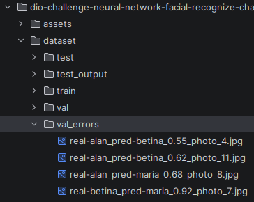

## Teste do modelo

Para os testes do modelo foi utilizado o `classify_test_images.py` que obtem as imagens da pasta `dataset/test` e aplica
o modelo detectando e rotulando as faces encontradas e grava o resultado em `dataset/test_output`.

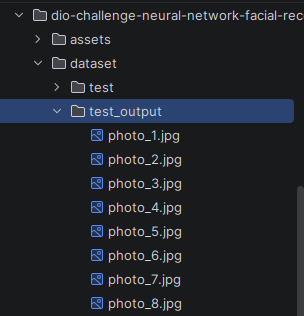

Os resultados foram bem variados algumas imagens nao foram detectadas (provavelmente devido a iluminações / contrastes
diferentes), outras rostos de outras pessoas foram confundidos e outros marcados como desconhecidos, 
talvez se tivesse um treinamento com outros rostos 'desconhecidos' ele soubesse categorizar melhor estes casos,
em algumas imagens ele se saiu bem e rotulou corretamente as 3 faces `alan`, `betina`, `maria` conforme abaixo:

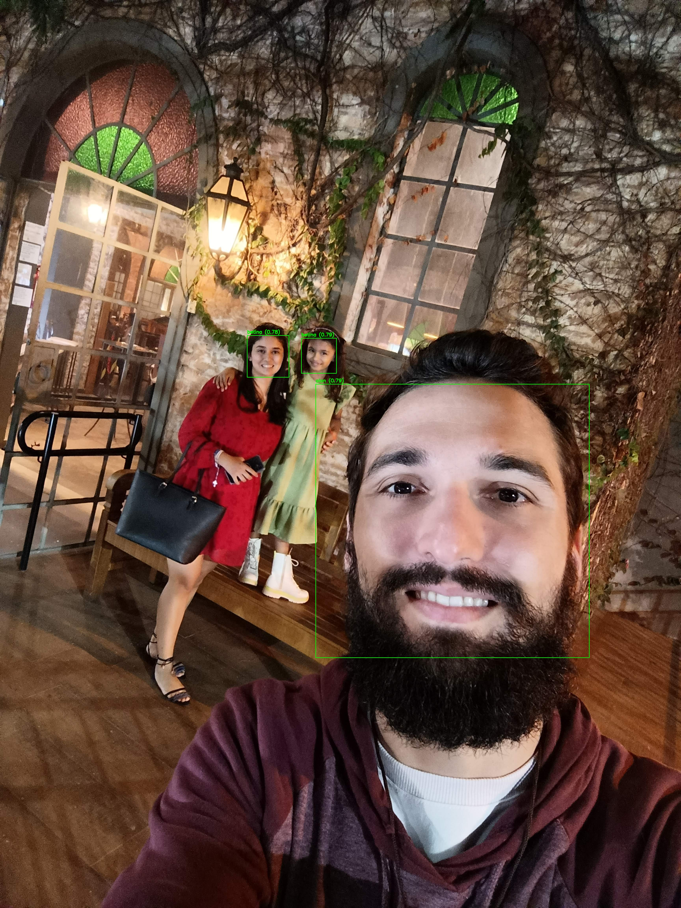

Podemos perceber que mesmo o modelo tendo uma excelente performance no treino e validação, no teste ele não se saiu 
muito bem, talvez aumentando a amostra de validação eu poderia te-lo tunado melhor, ou até mesmo aumentando a amostra
de treino com capturas em outro ambiente.

Ainda assim foi feito um teste de detecção em tempo real utilizando o `detection.py` que carrega o modelo e usa para 
detectar e classificar as faces com algumas modificações para mostrar um rotulo mais assertivo.

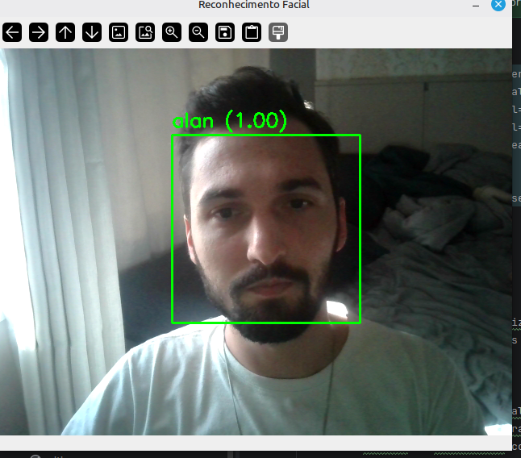